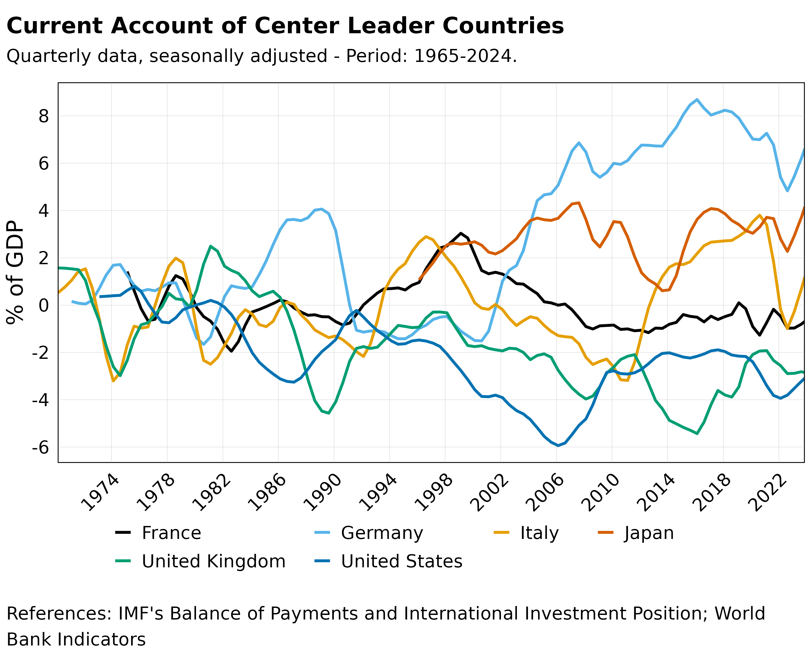

```{r setup, include=FALSE}
knitr::opts_chunk$set(
  collapse = TRUE,
  comment = "#>",
  fig.width = 7,
  fig.height = 5,
  fig.align = 'center'
)
```

# Installation

You can install the WPD package from GitHub:

```{r installation, eval=FALSE}
# install.packages("devtools")
devtools::install_github("benjaminpeeters/WPD")
```

Load the package:

```{r load}
library(WPD)
```

# Basic Usage

## Accessing Data

The main function `wp_data()` provides access to the database. Here's a simple example:

```{r basic-example}
# Get GDP data for a specific country
data <- wp_data(
  ISO = "USA",
  formula = c("GDP_C", "CU_C/GDP_C*100"),
  variable = c("GDP", "Current Account"),
  years = c(2000, 2023)
)

# Preview the data
head(data)
```

## Basic Visualization

The package includes built-in visualization functions:

```{r basic-plot}
# Create a basic time series plot
wp_plot_series(data, 
               y_axis = c("Billion USD", "% of GDP"),
               right_axis = "Current Account",
               title = "GDP and Current Account of the United States")
```

```{r, fig.cap="", echo=FALSE, out.extra='alt="Time series plot showing GDP and Current Account of the United States"'}

```


# Data Structure

WPD includes quarterly (`DATA_Q`) and yearly (`DATA_Y`) dataframes:


1. **Economic Indicators**
   - GDP and its components
   - Trade statistics
   - Price indices
   
2. **Financial Indicators**
   - Exchange rates
   - Interest rates
   - Stock market indices

3. **Social Indicators**
   - Population statistics
   - Employment data
   - Education metrics


## Available Countries and Indicators

You can view available data using helper functions:

```{r available-data}
# View quarterly data
wp_info("Q")
```


# Additional Resources and Documentation

You can also have access to `METADATA_Q`, `METADATA_Y`, and various list containing mappings for ISO3 codes using:


```{r load-metadata}
# Load metadata for quarterly and yearly data
data(METADATA_Q)
data(METADATA_Y)
# Load ISO3 Codes lists
data(ISO_DATA)
```

For more information about these data, we can also ...


## Additional Ressources

- Package documentation: `help(package = "WPD")` or `??WPD`
- GitHub repository: https://github.com/benjaminpeeters/WPD
- Bug reports: https://github.com/benjaminpeeters/WPD/issues


