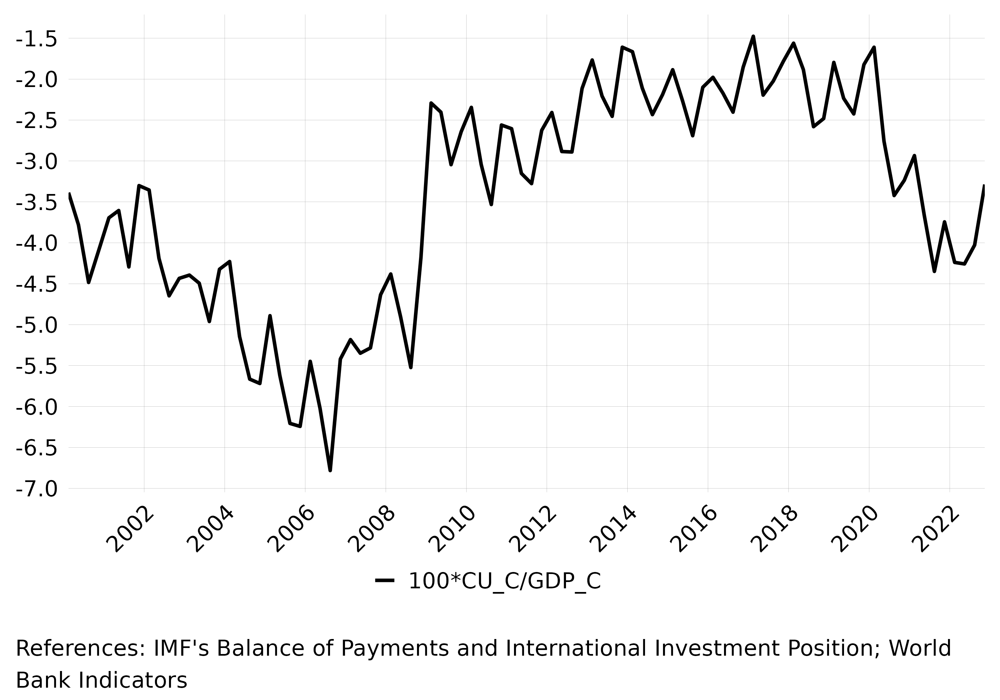
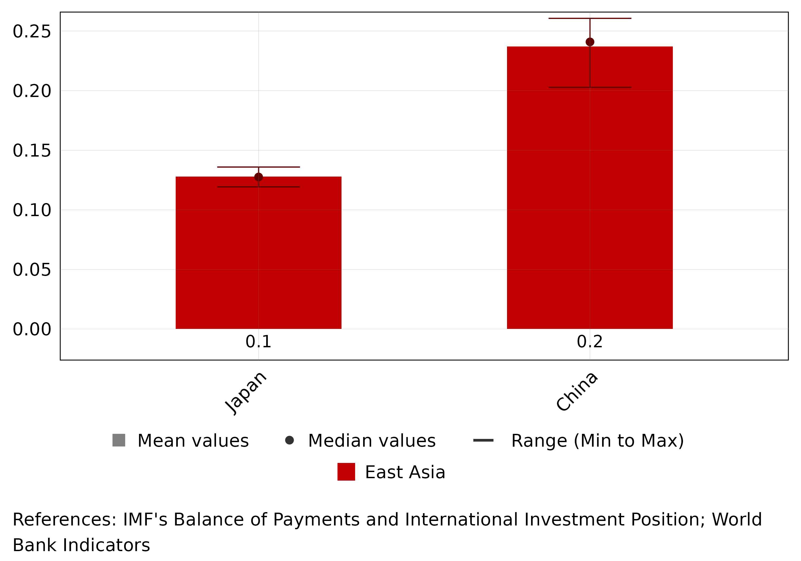

 


```{r vignette_setup, include=FALSE}
library(WPD)
# Load precomputed data
source("data/basic_example.R")
source("data/advanced_example.R")
```

## Basic Analysis: Single Country Example

To analyze a country's economic indicators, start with a simple example. Here's how to calculate the US current account as a percentage of GDP: 


```{r basic_example_code, eval=FALSE}
basic_example <- wp_data(
  ISO = "USA",
  formula = "100*CU_C/GDP_C",
  years = c(2000, 2002)
)
```

This returns a data frame with the results: 


```{r show_basic_results}
head(basic_example)
```

We can visualize this data using `wp_plot_series()`: 


```{r basic_plot_code, eval=FALSE}
wp_plot_series(basic_example)
```

 

## Advanced Analysis: Multiple Countries

For comparative analysis, we can examine multiple countries. Let's look at export ratios for China and Japan: 


```{r advanced_example_code, eval=FALSE}
advanced_example <- wp_data(
  ISO = c("CHN", "JPN"),
  formula = c("EXg_C/GDP_C"),
  years = c(2010, 2012)
)
```

Here's the resulting data: 


```{r show_advanced_results}
head(advanced_example)
```

We can create a bar plot to compare these values: 


```{r advanced_plot_code, eval=FALSE}
wp_plot_bar(advanced_example)
```

 

